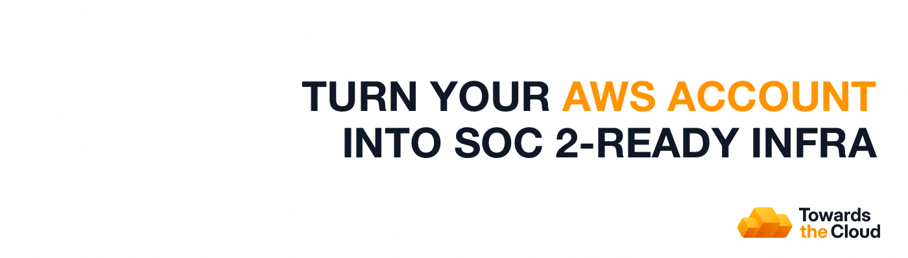

# 

**Towards the Cloud is an AWS Cloud Agency for startups and growing companies looking to build faster on AWS while cutting costs and accelerate their compliance.**

---

AWS starts simple. As you scale, technical debt compounds, environments blur, resources multiply without ownership, security findings pile up, and costs climb month after month.

**We provide a secure AWS foundation and own it entirely, so your team ships features instead of managing infra.**

## Here's How We Do It

**1. Secure [AWS CDK Landing Zone](https://towardsthecloud.com/services/aws-cdk-landing-zone) That Accelerates Compliance**

- Multi-account architecture with security controls and compliance guardrails from day one
- 100% on [CIS AWS Foundations](https://docs.aws.amazon.com/securityhub/latest/userguide/cis-aws-foundations-benchmark.html) and 96% on [AWS Security Best Practices](https://docs.aws.amazon.com/securityhub/latest/userguide/fsbp-standard.html), mapping directly to **SOC 2**, **HIPAA**, and **PCI-DSS**, cutting months from compliance

**2. Proactive Monitoring to Stop Cost Waste and Security Drift**

- Quarterly cost reviews clean up orphaned resources before they compound, reducing AWS spend by 20-30% on average, with [outliers hitting 60+%](https://towardsthecloud.com/services/aws-cost-optimization#case-study)
- Continuous security monitoring catches misconfigurations immediately. You get alerts while issues are fixable, not after they're breaches

**3. Senior AWS Expertise That Accelerates Delivery**

- Production-ready IaC templates for common patterns. What takes weeks of research ships in hours
- Solutions architecture guidance on VPC design, IAM, disaster recovery, and observability from engineers who've solved these problems at enterprise scale

[*"We achieved a perfect security score in days, not months."*](https://towardsthecloud.com/blog/case-study-accolade)
— Galen Simmons, CEO, Accolade (Y Combinator Startup)

### Book a Free Discovery Call

See how we take ownership of your AWS foundation. We'll walk you through our AWS CDK Landing Zone, CI/CD pipelines, and IaC library.

