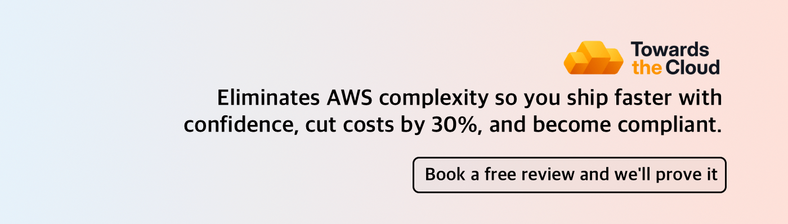

# 

**We help startups and growing companies build faster on AWS while maintaining control over security, compliance, and costs as they scale.**

AWS starts out simple, but as you scale, infrastructure rarely gets the upfront design it needs. It just evolves. The result is that either everything's crammed into one account (dev, staging, prod all mixed together), or you've got multiple accounts with no clear structure where production workloads sit alongside experiments.

Without proper visibility from scattered logs and untagged resources with no clear owner, you lose control. Vulnerabilities go unnoticed and the AWS bill keeps climbing without you realizing why.

We solve this by taking complete ownership of your AWS foundation so your team stops firefighting infrastructure and focuses on shipping features that drive growth.

**⚡ Here's how we do it:**

**1. We deploy a Landing Zone to set a strong foundation on AWS**
- Secure multi-account setup with SSO, centralized logging, and compliance controls (SOC 2, HIPAA) built in from day one.
- New AWS accounts provision automatically with security guardrails that achieve a perfect [100% CIS AWS Foundation Benchmark score](https://towardsthecloud.com/services/aws-landing-zone#chaos-to-control).
- [Learn more about our Landing Zone](https://towardsthecloud.com/services/aws-landing-zone)

**2. We watch over your AWS environment to catch cost waste and security gaps**
- We catch cost waste and security gaps before they become problems. Idle resources get flagged, misconfigurations get fixed, and your AWS bill stays under control.
- [See how we cut AWS costs by 30-60%](https://towardsthecloud.com/services/aws-cost-optimization) and [how we prevent security incidents](https://towardsthecloud.com/services/aws-security-review)

**3. We accelerate your Cloud journey**
- We are an extension of your team and do that by providing production-ready Infrastructure as Code patterns, architecture consulting, and DevOps expertise backed by a decade of experience in building production workloads on AWS.
- Your team can now focus on the product while we help build more redundant, scalable infrastructure and ship new environments in hours, not weeks.

**What this looks like in practice:**
- 30–60% lower AWS costs through proactive optimization ([see the breakdown](https://towardsthecloud.com/services/aws-cost-optimization#case-study))
- SOC 2 readiness achieved in days instead of months
- Development teams shipping infrastructure changes in hours with production-ready patterns and expert guidance

[*"We achieved a perfect security score in days, not months."*](https://towardsthecloud.com/blog/case-study-accolade)
— Galen Simmons, CEO, Accolade (Y Combinator Startup)

Start with a free assessment to uncover your infrastructure gaps and see how our Managed Landing Zone Service solves them. No commitment required.

